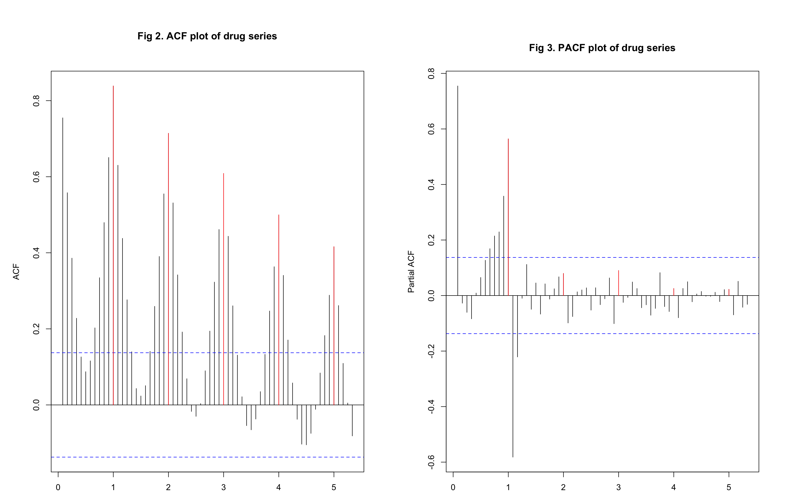
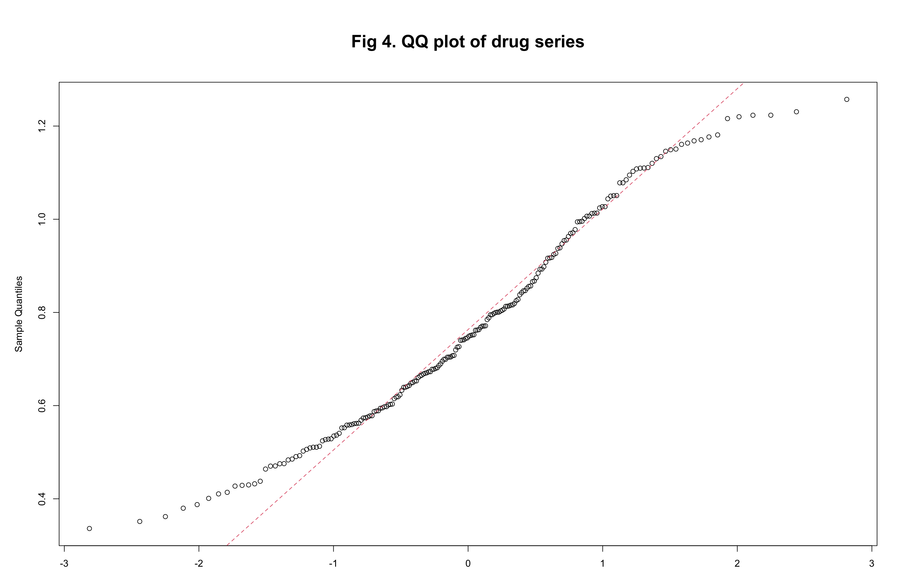
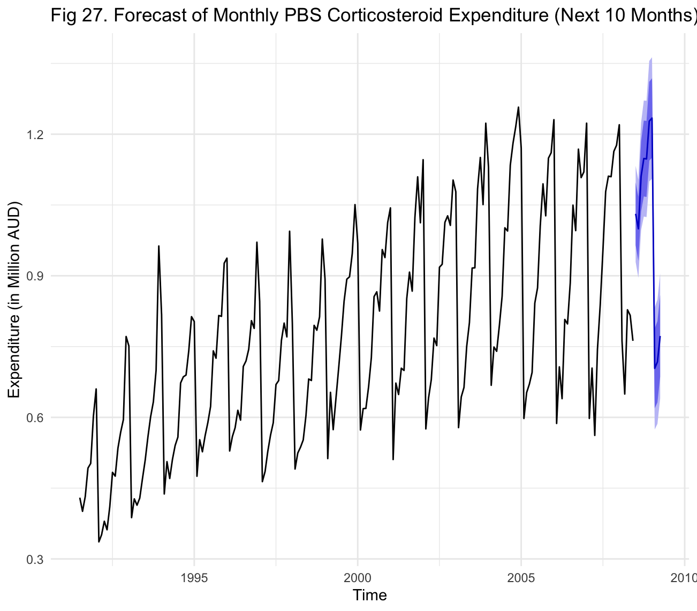

# SARIMA Forecasting — Australian PBS Corticosteroid Expenditure

A time series analysis and forecasting project applying SARIMA modelling 
to monthly Australian government drug expenditure data.

> Built as part of RMIT MATH1318 Time Series Analysis

---

## 📌 Project Overview

This project forecasts monthly PBS corticosteroid expenditure in Australia 
using a structured residual-based SARIMA modelling approach. The analysis 
covers data from July 1991 to June 2008, with a 10-month forecast generated 
for July 2008 to April 2009.

---

## 📊 Dataset

- **Source:** `h02` dataset from the `fpp2` R package
- **Period:** July 1991 – June 2008 (204 months)
- **Variable:** Monthly government spending on corticosteroids (Million AUD)
- **No missing values**

---

## 🧠 Methodology

### Exploratory Data Analysis
- Time series plot revealed clear upward trend and strong seasonality
- ACF/PACF plots confirmed seasonal structure at lag 12
- Shapiro-Wilk test confirmed mild non-normality

### Model Building (Residual Approach)
| Step | Model | Description |
|---|---|---|
| m1 | ARIMA(0,0,0)(0,1,0)[12] | Seasonal differencing only |
| m2 | ARIMA(0,0,0)(2,1,1)[12] | Added seasonal AR and MA terms |
| m3 | ARIMA(0,1,0)(2,1,1)[12] | Added ordinary differencing |
| m4 | ARIMA(4,1,3)(2,1,1)[12] | Full SARIMA model |

### Model Selection
- EACF table used to identify candidate models
- BIC heatmap used to confirm best AR/MA combinations
- 7 candidate models evaluated using AIC, BIC, and accuracy metrics

### Final Model
**SARIMA(4,1,1)×(2,1,1)[12]**
- Best AIC: -569.37
- Best BIC: -540.10
- RMSE: 0.049
- MAPE: 4.761%

---

## 📈 Results

### Forecast (July 2008 – April 2009)

| Month | Point Forecast | 95% CI Lower | 95% CI Upper |
|---|---|---|---|
| Jul 2008 | 1.0312 | 0.9294 | 1.1330 |
| Aug 2008 | 0.9996 | 0.8958 | 1.1034 |
| Sep 2008 | 1.1105 | 0.9966 | 1.2244 |
| Oct 2008 | 1.1484 | 1.0256 | 1.2713 |
| Nov 2008 | 1.1476 | 1.0243 | 1.2708 |
| Dec 2008 | 1.2275 | 1.0999 | 1.3552 |
| Jan 2009 | 1.2342 | 1.1055 | 1.3629 |
| Feb 2009 | 0.7039 | 0.5744 | 0.8333 |
| Mar 2009 | 0.7177 | 0.5861 | 0.8493 |
| Apr 2009 | 0.7724 | 0.6402 | 0.9046 |

---

## 📉 Key Plots

### Time Series Plot


### ACF and PACF


### QQ Plot


### Final Model Residuals


### 10-Month Forecast


---

## 🗂️ Project Structure

```
sarima-drug-expenditure-forecasting/
├── scripts/
│   ├── final.R           # Complete analysis and modelling script
│   └── presentation.R    # Presentation script
├── report/
│   ├── report.pdf        # Full project report
│   └── report.docx       # Editable report
├── docs/                 # All analysis plots
└── README.md
```

---

## ⚙️ How to Run

**1. Install required R packages:**
```r
install.packages(c("fpp2", "tseries", "TSA", "lmtest", "forecast"))
```

**2. Open and run the script:**
```r
source("scripts/final.R")
```

---

## 🛠️ Tech Stack

| Area | Tools |
|---|---|
| Language | R |
| Packages | fpp2, forecast, TSA, tseries, lmtest |
| Models | SARIMA |
| IDE | RStudio |

---

## 👤 Author
**Om Kadam**  
RMIT University — MATH1318 Time Series Analysis
